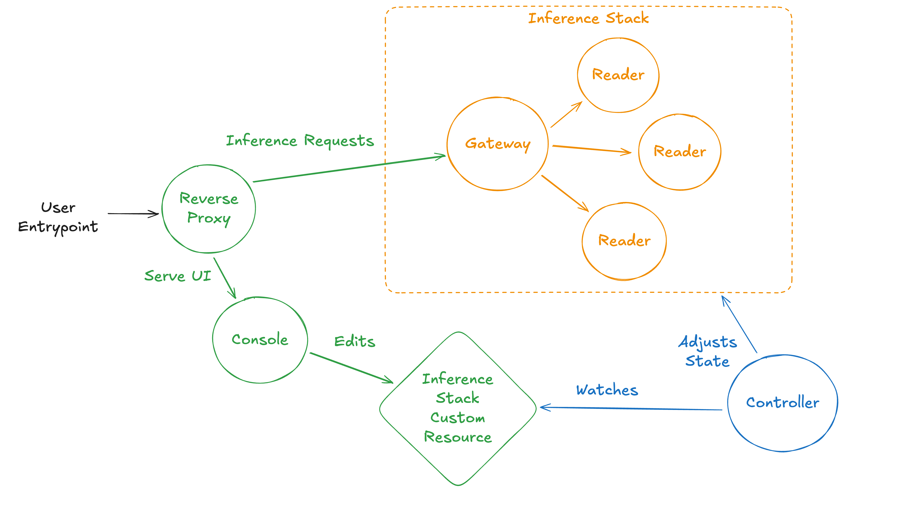

# Takeoff Helm Charts

The Takeoff Stack provides helm charts allow you to deploy open source AI on Kubernetes at any scale.

## Architecture

### Overview

The Takeoff stack revolves around a Custom Resource Definition (CRD) called the `InferenceStack`. We follow the kubernetes convention of creating an object representation and have an operator that reconciles the desired state. Below is a high level overview of the architecture:



The controller in this context is a sub-component of the operator that watches the Custom Resource `InferenceStack`. We create this controller/operator with the [system installation](./system/README.md#installation) which is a one off cluster wide installation step.

### Project Structure

```plaintext
charts/
├── catalog/          # Cluster Catalog, `InferenceStack` Custom Resource Definition (CRD) and Cluster Extensions, installed in the system helmfile.
├── console/          # Console UI, an empty `InferenceStack` Custom Resource which the UI can manipulate.
├── inference-stack/  # Gateway, and numerous Readers.
└── monitoring/       # Custom configuration of the kube-prometheus-stack helm chart provided by the Prometheus Community, installed in the system helmfile.
system/
├── README.md         # Step-by-step guide to install all the cluster wide dependencies needed to run the inference-stack or console charts.
├── ...
```

## Getting Started

1. *If installing Takeoff Stack for the first time* - follow the steps in the [system docs](./system/README.md#installation) to install the system dependencies.
2. Install the [console](./charts/console/README.md) helm chart, access the console UI to edit and view your stack.

## Glossary

* Cluster: a group of computing nodes, or worker machines, that run containerized applications, managed by a control plane that orchestrates and manages the cluster's resources and workloads.

* Console: a management interface that allows users to manipulate `InferenceStacks`. It also can be used for observability of the deployed models.

* Custom Resource Definition: a kubernetes object that extends the Kubernetes API and is available for use in the cluster.

* [Helm Operator](https://github.com/operator-framework/helm-operator-plugins): an open source Operator from the Operator Framework project

* `InferenceStack`: the custom resource that we deploy which has the configuration for each application that the user wants to be reconciled by the Inference Stack Operator.

* Controller: a set of objects that are responsible to transforming a custom resource into a set of kubernetes native objects. Any custom resource that is deployed in the cluster is managed by an operator.

* Operator: the combination of a Custom Resource Definition and a Controller.

* [Operator Lifecycle Manager (OLM)](https://operator-framework.github.io/operator-controller/): a tool that helps install, update, and manage the lifecycle of all Operators and their associated services running across their clusters.

* Cluster Catalog: a curated collections of Kubernetes extensions, such as Operators. Cluster administrators can enable polling to get over-the-air updates to `clusterCatalogs` when extension authors publish changes such as bug fixes and new features.

* Cluster Extension: components that expand the Kubernetes API without modifying its source code. Some examples of extensions are Operators, Custom Resource Definitions (CRDs), and Service Meshes.

* Gateway: the entrypoint into the Inference Stack, it receives all requests to individual models and routes them to the correct queue exposed by a server.

* Reader: an individual model that is running in the Inference Stack. It connects to the server of the Gateway to pull requests and process them.

* Consumer Group: the group of collective readers that pull from a single queue. Note, readers can belong to more than one consumer group, it is a mapping from many queues to many readers.
