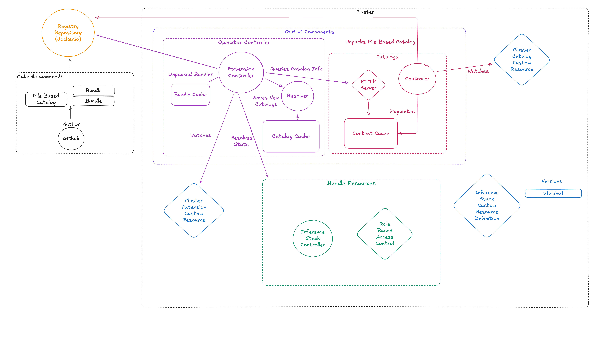
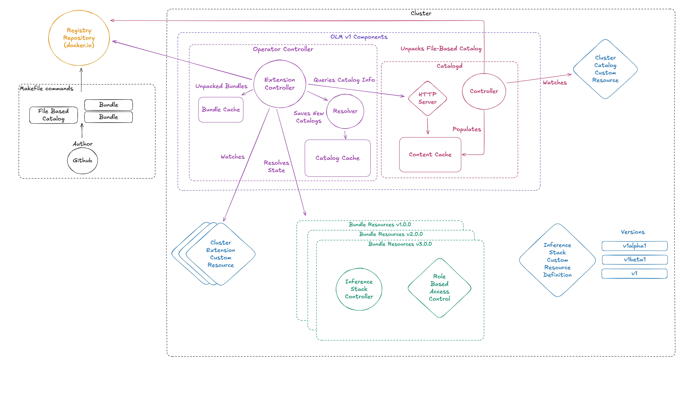

# Inference Stack Operator Lifecycle Manager

The Inference Stack Operator Lifecycle Manager (OLM) oversees Kubernetes operators, and specifically we use it to control the lifecycle of the Inference Stack.

## Project Structure

```plaintext
operator-lifecycle-manager/
├── helm-charts/          # Operator's Helm charts
│   └── inference-stack/  # Managed application chart
├── bundle/               # OLM bundle files
├── config/               # Operator configuration, contains all the resources that make up a single Operator excluding the CRD.
├── catalog/              # Operator catalog, houses the Operator catalogs and their constructed manifests which are mounted in the catalog image.
├── Dockerfile            # Operator Dockerfile
├── Dockerfile.catalog    # Catalog Dockerfile
├── Dockerfile.controller # Controller Dockerfile
├── watches.yaml          # Operator watches
└── Makefile              # Build and deployment commands, get list of commands by running `make help`
```

## Architecture

### Overview

This is an overview of the Inference Stack Operator Lifecycle Manager:



### OLM v1 Components

From running the OLM [install script](../README.md#installation), a `Catalogd` and an `Operator Controller` are created in the `olmv1-system` namespace. These watch two CRDs, `ClusterCatalog` and `ClusterExtension`, respectively.

#### Catalogd

The Catalogd is responsible for unpacking file-based catalog images on a repository and storing them in it's cache so they can be queried via the HTTP API. It knows which catalogs to fetch and unpack by watching the `ClusterCatalog` CRD.

#### Operator Controller

The Operator Controller queries the Catalogd cache via the HTTP API and stores the catalog and the unpacked bundles in two separate caches. This is the Controller that is responsible for installing the Operator specified in the `ClusterExtension` CR.

### Author

An author is responsible for publishing both bundle and catalog images to a repository so they can be used in the cluster by the OLM. For a detailed guide on how to create and publish new Operator bundles and catalogs see [Contributing.md](./Contributing.md#publishing).

### Bundle Resources

These are the resources that make up a single Operator. In our case, that is just the `InferenceStack` Controller and the Role Based Access Control (RBAC) needed to run it. Ideally we would pack into the bundle the `InferenceStack` Custom Resource Definition (CRD) but this has problems. The first is that if you give the bundle an owned CRD it will try take ownership of it when installed. This is fine if you only have one Operator running, but when you have more than one they both try and own the same CRD even if they are installing different/the same versions. The alternative is to give the bundle a required CRD so it just checks that it's CRD version is present in the cluster. This is not possible due to a [limitations of the OLM v1](https://operator-framework.github.io/operator-controller/project/olmv1_limitations/) which cannot have required properties. We'd need to have the CRD installed separately anyway so we only lose out on some validation when the `ClusterExtensions` are installed. The CRD is installed in the [catalog](./../../charts/catalog/README.md) helm chart. If it is not present then the Operator will fail at runtime which is not desirable but is the best we can do with the current limitations.

#### Inference Stack Controller

The Controller that we use is based upon the [Helm Operator](https://github.com/operator-framework/helm-operator-plugins) from the [Operator Framework](https://operatorframework.io/). It watches for Custom Resources (CRs), templates a helm chart, and resolves the produced state. The CR then is effectively the values file for the helm chart. You can point the Controller to watch more than one CR, but in our case we only use one, the `InferenceStack` CR. The watch config for the Controller is defined in the [`watches.yaml`](./watches.yaml) file. The helm chart we use is the [inference-stack](./../../charts/inference-stack/README.md) chart, and it is mounted in the Controller image.

We use semantic versioning for the Controller which is not necessarily in sync with the version of the helm chart it is templating. This is because the Controller is a separate entity from the helm chart and can be updated independently. The version of the Controller is defined in the [`Makefile`](./Makefile) and is used to tag the Controller image. for more details on how to build and push the Controller image see the [contributing guide](./Contributing.md#publishing).

#### Role Based Access Control

The Controller that runs needs permissions to view our `InferenceStack` Custom Resource (CR) and to create the resources that are defined in the CR. This is done by creating a Service Account, Cluster Role, and Cluster Role Binding for the Controller to use. They are cluster level not namespace level because the Controller needs to be able to view all `InferenceStack` CRs in the cluster and write into namespaces that are not it's own.

### Inference Stack Custom Resource Definition

The `InferenceStack` CRD is installed by the [catalog helm chart](./../../charts/catalog/README.md). There is a many to many mapping between the supported versions of the `InferenceStack` CRD and the versions of the `InferenceStack` Controller. This is because the CRD is not owned by the Controller and many Controllers can watch the same CRD. The CRD is versioned using the [Kubernetes API versioning scheme](https://kubernetes.io/docs/reference/using-api/#api-versioning). All supported versions of the CRD are added to the [catalog helm chart](./../../charts/catalog/README.md) and only remove if no bundles in the catalog reference that version. We keep a record of the supported CRD versions for each Operator version in the [changelog](./../CHANGELOG.md#operator).

### Cluster Catalog

The custom resource that is installed by the [OLM setup script](./CONTRIBUTING.md#prerequisites) that references a remote container registry that houses an File-Based Catalog Image. It is consumed by the [`Catalogd`](#catalogd) to unpack the catalog and store it in it's cache .See our [contributing guide for details](./Contributing.md#installing-a-catalog) on configuring Cluster Catalogs.

### Cluster Extension

The custom resource also installed by the [OLM setup script](./CONTRIBUTING.md#prerequisites) which describes an installation strategy for an Operator. We use the semantic template for our catalog so we have channels based on the major version of the Operator. See our [contributing guide for details](./Contributing.md#installing-a-new-operator-bundle) on configuring Cluster Extensions to create new Operator Bundles.

### Installing Multiple Operators

This architecture can be used to install and manage multiple version of the Inference Stack Operator. This would extend the architecture diagram as follows:



The main change is seen in the multiple Cluster Extension CRs and the `InferenceStack` CRD having multiple versions. This generates multiple Operator bundles running the the cluster. For details on how to install and manage multiple operators see [the developer guide here](./CONTRIBUTING.md#installing-a-new-operator-bundle). We have designed this system to support multiple operators that have different major versions. If you install multiple operators with the same major version then your `InferenceStack` CRs will be reconciled by more than one Operator. This is not a desirable state and should be avoided.
