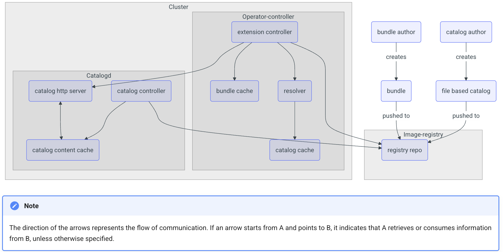

# Model Orchestra Operator Lifecycle Manager

The Model Orchestra Operator Lifecycle Manager (OLM) oversees Kubernetes operators, and specifically we use it to control the lifecycle of the Model Orchestra.

## Project Structure

```plaintext
operator-lifecycle-manager/
├── helm-charts/          # Operator's Helm charts
│   └── model-orchestra/  # Managed application chart
├── bundle/               # OLM bundle files
├── config/               # Operator configuration, contains all the resources that make up a single operator excluding the CRD.
├── catalog/              # Operator catalog, houses the operator catalogs and their constructed manifests which are mounted in the catalog image.
├── Dockerfile            # Operator Dockerfile
├── Dockerfile.catalog    # Catalog Dockerfile
├── Dockerfile.controller # Controller Dockerfile
├── watches.yaml          # Operator watches
└── Makefile              # Build and deployment commands, get list of commands by running `make help`
```

## Architecture



From [OLM v1 docs](https://operator-framework.github.io/operator-controller/project/olmv1_architecture/), see there for further detail.

### Overview

Model Orchestra are versioned helm charts. The operator that we use to reconcile this chart is the Helm Operator from the Operator Framework. This holds a version of the watched helm chart in it's running image and templates the resources needed using a values file compiled from the spec of the Model Orchestra Custom Resource. The Controller inside the Helm Operator holds a versioned snapshot of the helm chart files it is watching and so need to be managed carefully. We bundle versioned operators and store each bundle in a catalog with channels. A client in the cluster can then subscribe to a channel and install a specific operator or supported channel from the catalog.

A full breakdown of what the Operator Lifecycle Manager does can be found in their [docs](https://operator-framework.github.io/operator-controller/).

## The Cluster Catalog

This is an object in Kubernetes that stores channels of Operator bundles. It doesn't have the bundle code itself by has a list of canonical images that can be installed. The catalog exposes a http query that can be used to get the list of available operators and their versions. More detail is found in [these docs](https://operator-framework.github.io/operator-controller/tutorials/explore-available-content/) on how to explore the catalog.

### Operator Bundles

An Operator bundle is simply a collection of kubernetes resources that are packaged into a single image which one installed can reconcile a custom resource. The bundle is versioned and can be installed by a client in the cluster. Often the definition of the custom resource is also included in the bundle, but not in our case currently.

We create the OLM looks at a
